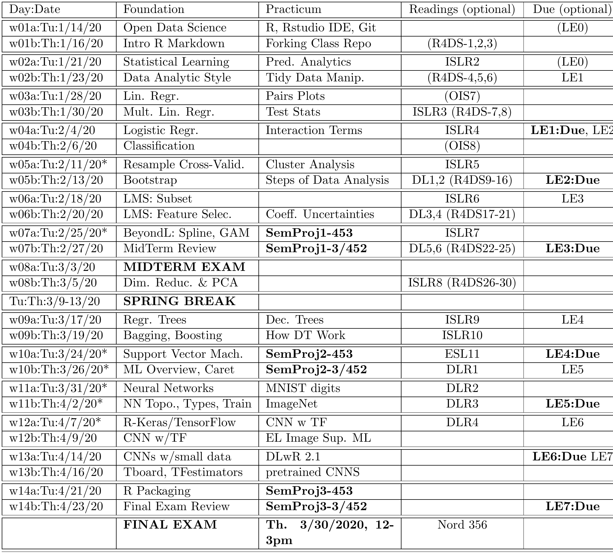

```{r setup, include=FALSE}
knitr::opts_chunk$set(echo = TRUE)
knitr::opts_chunk$set(fig.width = 6, fig.height = 4.5) 
```

 \setcounter{section}{1}
 \setcounter{subsection}{1}
 \setcounter{subsubsection}{0}

#### Reading, Homeworks, Projects, SemProjects

  - Readings for next class: 
    - 
    - 
  - Laboratory Exercises: 
    - 
  - SemProjects:   
    - SemProjects: have 4 parts, we'll have reports on Sect. 1,2 then 3,4
      - SemProj Report Out #1 in Class w07a,07b, Tues/Thurs, Feb. 25,27
      - SemProj Report Out #2 in Class w10a,10b, Tues/Thurs, March 24,26
      - SemProj Report Out #3 in Class w14a,14b, Tues/Thurs April 21,23
      - SemProj Report #4 is the full, comprehensive project due at final exam.
    - These are Peer Graded
    - Assistance on SemProjects is done in DSCI352-352m-452 Class
      - DSCI352 meetings during Friday Community Hour, 12:45 to 1:45pm in Olin 303
      - Is taught by Prof. Laura Bruckman (lsh41@case.edu)
  - Office Hours: 
    - Mondays, Wednesdays 4pm to 5pm in White 540 
  - Final Exam
    - Thursday March 30th, 2020, 12 noon to 3pm

#### Textbooks

##### Introduction to R and Data Science

For students new to R, Coding, Inferential Statistics

  - Peng: R Programming for Data Science
  - Peng: Exploratory Data Analysis with R
  - OIS = Diez, Barr, Çetinkaya-Runde: Open Intro Stat v4
  
##### Textbooks for this class

  - R4DS = Wickham, Grolemund: R for Data Science
  - ISLR = James, Witten, Hastie, Tibshirani: Intro to Statistical Learning with R
  - ESL = Trevor Hastie, Tibshirani, Friedman: Elements of Statistical Learning
  - DLwR = Chollet, Allaire: Deep Learning with R

#### Syllabus




  
<!-- 
 How to make comments inside Rmarkdown
# Script Name: My class notes template for Fall 2016
# Purpose: This is a template Rmd file to start a new class from
# Authors: Roger H. French
# License: Creative Commons Attribution-ShareAlike 4.0 International License.
##########
# Latest Changelog Entires:
# v0.00.01 - Filename.Rmd - Roger French started this blank Rmd script
-->

<!-- Or on a single line like this -->

#### Topic


