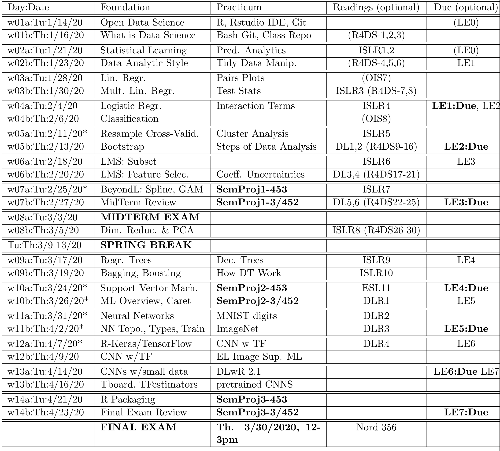

License: [CC-BY-SA 4.0](https://creativecommons.org/licenses/by-sa/4.0/)

```{r setup, include=FALSE}
knitr::opts_chunk$set(echo = TRUE)
```

 \setcounter{section}{1}
 \setcounter{subsection}{1}
 \setcounter{subsubsection}{1}
 
 <!-- 
 How to make comments inside Rmarkdown
# Script Name: My class notes template for Fall 2016
# Purpose: This is a template Rmd file to start a new class from
# Authors: Roger H. French
# License: Creative Commons Attribution-ShareAlike 4.0 International License.
##########
# Latest Changelog Entires:
# v0.00.01 - Filename.Rmd - Roger French started this blank Rmd script
-->

<!-- Or on a single line like this -->

#### Reading, Homeworks, Projects, SemProjects

  * Readings: 
    * [R4DS Chapters 1,2,3](https://r4ds.had.co.nz/) In Explore section
    * If you are new to R, Read Peng-EDAwR
      - And his Youtube Playlists of Computing for Data Analysis
      - [Peng-Computing For Data Analysis Playlist](https://youtu.be/EiKxy5IecUw?list=PL7Tw2kQ2edvpNEGrU0cGKwmdDRKc5A6C4)
  * Laboratory Exercises: 
    * LE0, a no credit excercise, is a useful intro to R
    - For those new to R
  - SemProjects:   
    - SemProjects: have 4 parts, we'll have reports on Sect. 1,2 then 3,4
      - SemProj Report Out #1 in Class w07a,07b, Tues/Thurs, Feb. 25,27
      - SemProj Report Out #2 in Class w10a,10b, Tues/Thurs, March 24,26
      - SemProj Report Out #3 in Class w14a,14b, Tues/Thurs April 21,23
      - SemProj Report #4 is the full, comprehensive project due at final exam.
    - These are Peer Graded
    - Assistance on SemProjects is done in DSCI352-352m-452 Class
      - DSCI352 meetings during Friday Community Hour, 12:45 to 1:45pm in Olin 303
      - Is taught by Prof. Laura Bruckman (lsh41@case.edu)
  - Office Hours: 
    - Mondays, Wednesdays 4pm to 5pm in White 540 
  - Final Exam
    - Thursday March 30th, 2020, 12 noon to 3pm

#### If you are new to R (Or want a quick refresher)

  - You can do Lab Excercise LE0a and LE0b
    - These are from Chapter 1,2 of Open Intro Stats (OISv3)


#### Textbooks

##### Introduction to R and Data Science

For students new to R, Coding, Inferential Statistics

  - Peng: R Programming for Data Science
  - Peng: Exploratory Data Analysis with R
  - OIS = Diez, Barr, Çetinkaya-Runde: Open Intro Stat v4
  
##### Textbooks for this class

  - R4DS = Wickham, Grolemund: R for Data Science
  - ISLR = James, Witten, Hastie, Tibshirani: Intro to Statistical Learning with R
  - ESL = Trevor Hastie, Tibshirani, Friedman: Elements of Statistical Learning
  - DLwR = Chollet, Allaire: Deep Learning with R

#### The DSCI courses and class sections

##### In these Applied Data Science (DSCI) classes

  - We focus on teaching all necesary data science skills
    - Including coding in R
    - Use of Rmarkdown for data analysis reports and presentations
    - Git for code versioning and collaboration
    - Linear and non-linear regression and classification
    - Beyond linear modeling, including Support Vector Machines, Random Forest
    - Machine Learning, including Neural Networks, non-parametric regression
    - Deep Learning, including Keras/TensorFlow running on GPUs


##### The course sections

  - DSCI35x (x = 1,3,2) 
    - Is undergraduate class for "general" applied data science
  - DSCI35xM (x=1,2,3) focuses on materials science systems
  - DSCI45x (x=1,2,3)
    - Is a graduate level class
    - With the same class material and DSCI35x
    - Additionally the students do a 40 point Semester Data Analysis Project

##### The specific courses

  - DSCI351, 351M, 451 
    - Is an introduction to Exploratory Data Science
  - DSCI353, 353M, 453 
    - Focuses on Modeling, Prediction and Machine Learning
  - DSCI 352, 352M, 452
    - Is a Semester long Data Science Project Class
    - Providing a data analysis for inclusion 
    - In your Data Science Portfolio

##### DSCI45x Graduate level courses

  - For graduate students, 
    - DSCI451 is not a required prerequisite
  - Therefore some DSCI453 grad. students
    - Do not have familiarity with Open Data Science, R, Git etc.
  - For these "New to R" students
    - The initial 3 weeks in class have optional content
    - To get people familiar with Open Data Science
    

##### Semester Data Science Projects

  - Are done in DSCI352, 352M by students who have completed both DSCI351,3
  - And by graduate students in DSCI 451, 453 and 452
  
For DSCI45x students, their Semester Project is developed in DSCI352 class

  - With Prof. Laura Bruckman
  - During team meetings during Friday Community Hour
    - 12:45 to 1:45 in Olin 303
  - And during class office hours
    - Monday/Wednesday 4pm to 5pm in White 540
  - There are weekly SemProj updates due each week on progress
  - And 3 SemProj Presentations in DSCI35x class

#### Syllabus

 

#### Operating Systems: Windows, OSX and Linux

Command Line Environments

  - Linux: Bash on Linux, or Git Bash on Windows
  - Mac OSX: Bash in Terminal
  - Windows: Command.com Terminal
  - In R: R Console, or Console in RStudio
  


    Item               Linux       OSX Mac       Windows 
-----------------  ------------  ------------  ------------ 
folder demarcation     /              /        "\\" don't use
directory listing     ls             ls            dir     
present work. dir     pwd           pwd           
change directory      cd            cd               cd
drives               root          root         drive letters
NO SPACES in        filenames     spaces         don't work


##### Basic/Universal Rules

  - No Spaces in Filenames
  - Only 1 period in a filename, before file extension
  - No other periods
  - Only Letters, Underscore (_), and Dashes (-) in Filenames
  - In code scripts, use forward slash in all file paths and directorys
  - You can use CamelBack or snake_case in variable or file names
    - To make code easier to read.
  - Code Style is Rstudio or Google R style
  - No use of = for Assignments
  - Only use <- as the Assignment Operator in R
    - Rstudio Cheat Sheet says <- is "Alt -" in R code


#### Quick Introduction to R/Rstudio/Git

R is the statistical programming language

Rstudio is the Integrated Development Environment (IDE)

Git is the distributed content versioning system

#### Things you need to do

##### Online accounts

  - Sign up for our [Class Slack](http://it-fundamental-2019.slack.com) with your personal or case.edu email 
  * Sign up for a [bitbucket.org](http://bitbucket.org) account 
    - with your case.edu address  
  * Sign up for a [twitter account](http://twitter.com), 
    - then follow @frenchrh, @hadleywickham, @dataandme, @JennyBryan
    - @minebocek, @juliasilge, @rdpeng, @jtleek, @robjhyndman
    - and others as you want, such as
    - @fchollet, @TensorFlow, @ylecun, @GoogleAI, @egorzakharovdl 
  * Sign up for a [stack overflow account on stack exchange](http://stackoverflow.com/)
    

##### Also get ODS VDI access

  * You should have access to the following resources 
    + Citrix Workspace. After installing the http address is [https://myapps.case.edu](https://myapps.case.edu)
  * Or [CWRU AWS Portal to Citrix Xen Desktop](https://myapps.case.edu) for VDIs
    + A Open Data Science (ODS) VDI

##### High performance computing (HPC) resources we will use

  - We will use Kaggle.com for Deep Learning with TensorFlow on GPUs
  - We will also use CWRU's HPC Data Science Cluster
    - This will get you familiar with working in HPC
    - Using Linux on GPU compute nodes
    - For Keras/TensorFlow with R
    - For Deep Learning

##### Lab Exercises are submitted and graded on Canvas

  - Assignment turn in pages will be posted when LE are given out.

##### Your Class Git Repo

  * My "Professor" Repo is 20s-dsci353-353m-453-prof
    + On bitbucket, you will fork this repo to your own account
    + Each day prior to class, update your fork from my prof. repo

 
#### Intro to some R: Data Types
 
  * Primitives (numeric, integer, character, logical, factor)
  * Data Frames
  * Lists
  * Tables
  * Arrays
  * Environments
  * Others (functions, closures, promises..)
 
##### Simple Types 

```{r,collapse=TRUE}
x <- 1
class(x)
 
y <- "Hello World"
class(y)
 
z <- TRUE
class(z)
 
as.integer(z)
```

##### Example: Generating Random Data {.smaller}

```{r}
randomWalk <- function(N)(cumsum(ifelse(rbinom(prob = 0.5, size = 1, N) == 0,-1,1)))
AUDUSD <- 1.2345 + randomWalk(1000)*.0001
plot(AUDUSD, type = 'l')
```
 
#### Recommended R Libraries

We're running R 3.6.2, named "Dark and Stormy Night"

All our "Standard R Packages" are loaded in the ODS VDI

##### Basic useful packages (and many more than this)

  - Rcpp - Convenient C++ interface 
  - zoo/xts - Time series libraries
  - Matrix - Enhanced matrix library

##### Hadley Wickham Tidyverse packages
  - This is the content of [R for Data Science (R4DS) book](https://r4ds.had.co.nz/). 
    - Using Pipes "%>%" to replace loops
    - Makes syntax more compact and readable
    - Makes code faster
  - [Tidyverse Style Guide](https://style.tidyverse.org/)
    - Using tidy dataframes
  - ggplot2 - Mini-DSL (domain specific language) for data visualization
  - plyr/reshape - Data reshaping/manipulation
  - dplyr
  - data.table - Faster data.frame manipulation
  - knitr -  for  markdown processing
  - among others like purrr etc.


##### Statistical and Machine Learning

  - e1071 Functions for latent class analysis, short time Fourier transform, fuzzy clustering, support vector machines, shortest path computation, bagged clustering, naive Bayes classifier etc (142479 downloads) 
  - MASS tools for variable selection etc.
  - rpart Recursive Partitioning and Regression Trees. (135390)
  - igraph A collection of network analysis tools. (122930)
  - nnet Feed-forward Neural Networks and Multinomial Log-Linear Models. (108298)
  - randomForest Breiman and Cutler's random forests for classification and regression. (105375)
  - caret package (short for Classification And REgression Training) is a set of functions that attempt to streamline the process for creating predictive models. (87151)
  - kernlab Kernel-based Machine Learning Lab. (62064)
  - glmnet Lasso and elastic-net regularized generalized linear models. (56948)
  - ROCR Visualizing the performance of scoring classifiers. (51323)
  - gbm Generalized Boosted Regression Models. (44760)
  - party A Laboratory for Recursive Partitioning. (43290)
  - arules Mining Association Rules and Frequent Itemsets. (39654)
  - tree Classification and regression trees. (27882)
  - klaR Classification and visualization. (27828)
  - RWeka R/Weka interface. (26973)
  - ipred Improved Predictors. (22358)
  - lars Least Angle Regression, Lasso and Forward Stagewise. (19691)
  - earth Multivariate Adaptive Regression Spline Models. (15901)
  - CORElearn Classification, regression, feature evaluation and ordinal evaluation. (13856)
  - mboost Model-Based Boosting. (13078)

#### Links
 
[http://www.r-project.org](http://www.r-project.org) 

Rory Winston, for the Learning R intro
[http://www.theresearchkitchen.com/archives/1017](http://www.theresearchkitchen.com/archives/1017)

R for Data Science [http://r4ds.had.co.nz/](http://r4ds.had.co.nz/)

  - Or pull the R4DS repo from Bitbucket [https://bitbucket.org/cwrudsci/r4ds](https://bitbucket.org/cwrudsci/r4ds)

  - [Peng-Computing For Data Analysis Playlist](https://youtu.be/EiKxy5IecUw?list=PL7Tw2kQ2edvpNEGrU0cGKwmdDRKc5A6C4)

Kaggle, Runs Open Data Science Competitions
[https://www.kaggle.com/](https://www.kaggle.com/)

