CWRU DSCI353-353M-453: 

Data Science Modeling, Prediction and Statistical and Machine Learning
========================================================
author: Roger H. French 
date: 16 January, 2020
autosize: true
transition: rotate
transition-speed: fast

Class 01b-f What is Data Science

Reading, Homeworks, Projects, SemProjects
=======================================================

  - Readings: 
    - for today: (R4DS 1-3)
    - For next Weds ISLR ch 1,2
  - Lab Exercise
    - (LE0 for introduction - no credit)
    - 
  - Data Science Projects: 
    - SemProjects:  
  

(Peng: R Programming for Data Science)

Syllabus
=====================================================

  
 

What is Data Science
======================================================== 
  - Build on discussion by Jenny Bryan 
    - @JennyBryan on Twitter
  - Of Univ. of British Columbia
  - Who teaches Stat 545 at Univ. of British Columbia 

Citation for these slides

[Univ. of British Columbia](http://www.stat.ubc.ca/~jenny/)

Big Data Brain Drain
======================================================== 

  In a wide variety of academic fields,
    - The ability to effectively process data
    - Is superseding other more classical modes of research
  
[Big Data Brain Drain](http://jakevdp.github.io/blog/2013/10/26/big-data-brain-drain/)

 What is Data Science
======================================================== 
type: section

======================================================== 
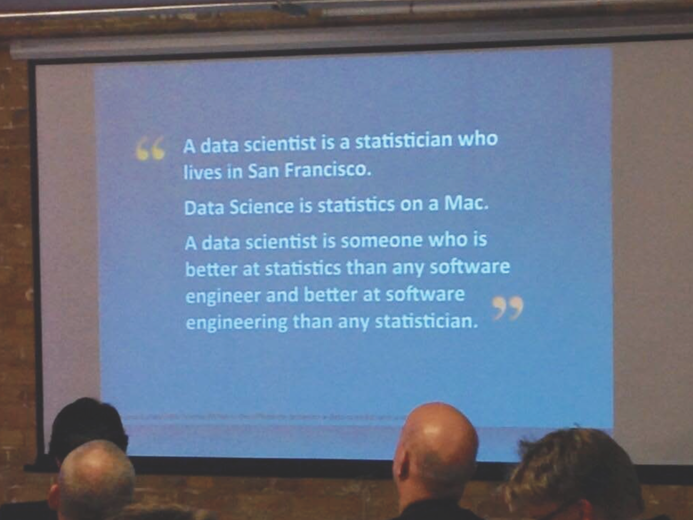

Data Science Venn Diagram
======================================================== 
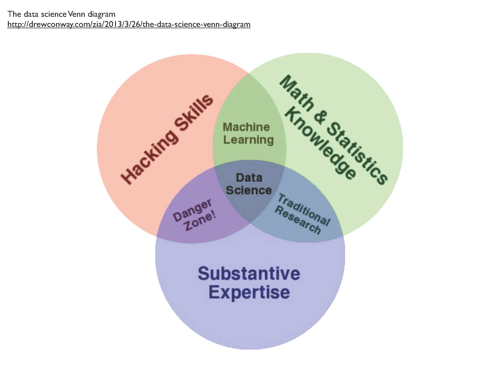

[Data Science Venn Diagram](http://drewconway.com/zia/2013/3/26/the-data-science-venn-diagram)

Another version of the Venn Diagram
=========================================================
Becoming a Data Scienctist

  - Data Science is a fast growing field in tech.
  - Data scinece includes people from multiple disciplines
    - Becoming a Data Scienctist Podcast shows different ways people came to data science
  - Couples engineering, math, statistics, langue, computer science skills

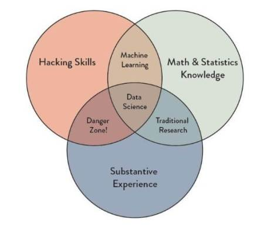

Figure 1: Three Skills for Data Scientists by Drew Conway

Importance on Soft Skills
==========================================================
  - Manage teams and projects across multiple departments on and offshore.
  - Consult with clients and assist in business development.
  - Take abstract business issues and derive an analytical solution.
  - Presentations
  - Social Communications
  - Curiosty
  - Understand business and relate business with tech
  
***
  - Understand and explain pitfalls in data analysis
  - Understand what the business needs and what data science can provide

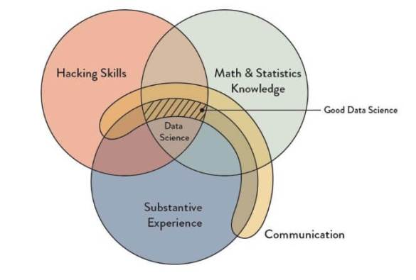

Figure 2: Revised Three Skills for Data Scientists by [Emily Walk a data scientist at Qriously](https://venturebeat.com/2017/02/18/the-one-critical-skill-many-data-scientists-are-missing/)

The Data Science Tidyverse  Workflow
========================================================
type: section

This blogpost about Tidyverse 

  - is in 3-readings/2-articles folder of your Git repo.

[What is the Tidyverse, by Joseph Rickert](https://rviews.rstudio.com/2017/06/08/what-is-the-tidyverse/)

Hadley Wickham Data Science Workflow 
======================================================== 
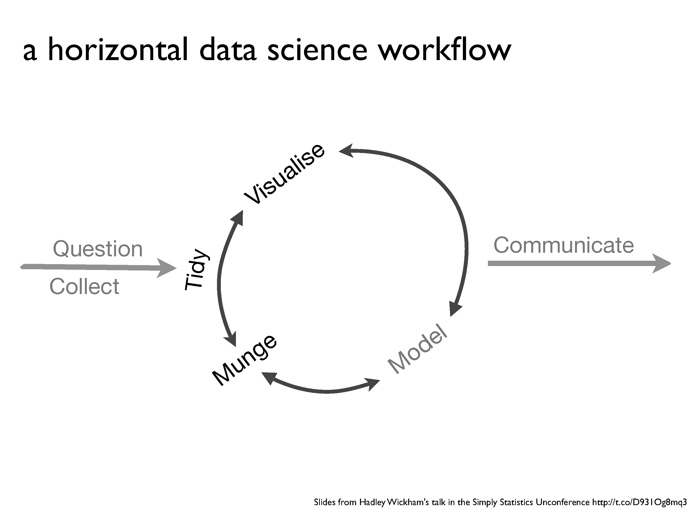

[Hadley Wickham's Slides from Simply Statistics Unconference](http://t.co/D931Og8mq3)

Data Science is not just modeling
========================================================

For Big-Data Scientists: "Janitor Work" is Key Hurdle To Insights
======================================================== 
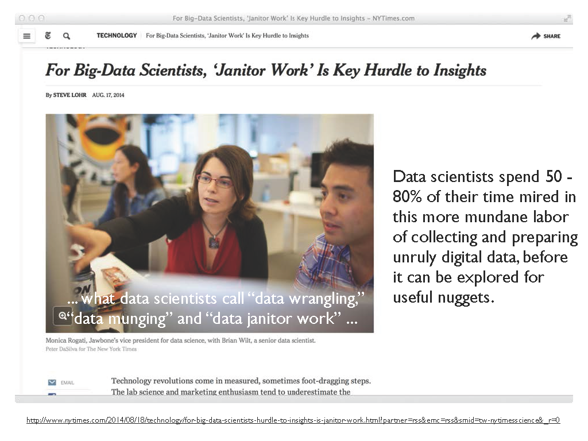

[NYTimes Article](http://www.nytimes.com/2014/08/18/technology/for-big-data-scientists-hurdle-to-insights-is-janitor-work.html?partner=rss&emc=rss&smid=tw-nytimesscience&_r=0)

Tidyverse is a set of R packages that help you perform Tidy data analyses
========================================================

======================================================== 
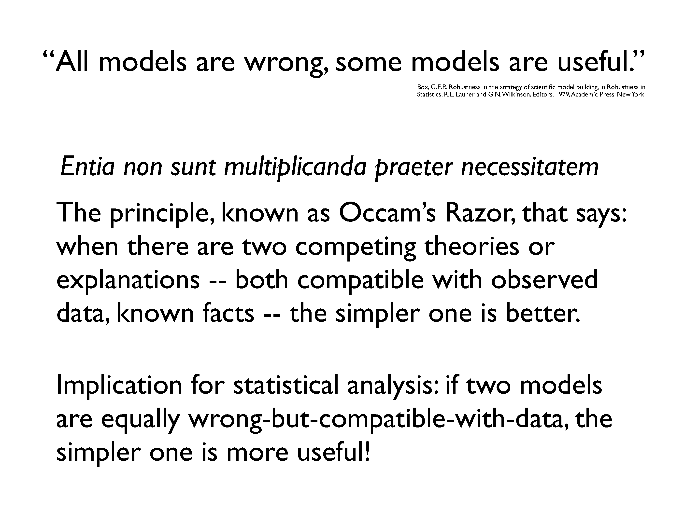

What about "Big Data"
======================================================== 
type:section

========================================================
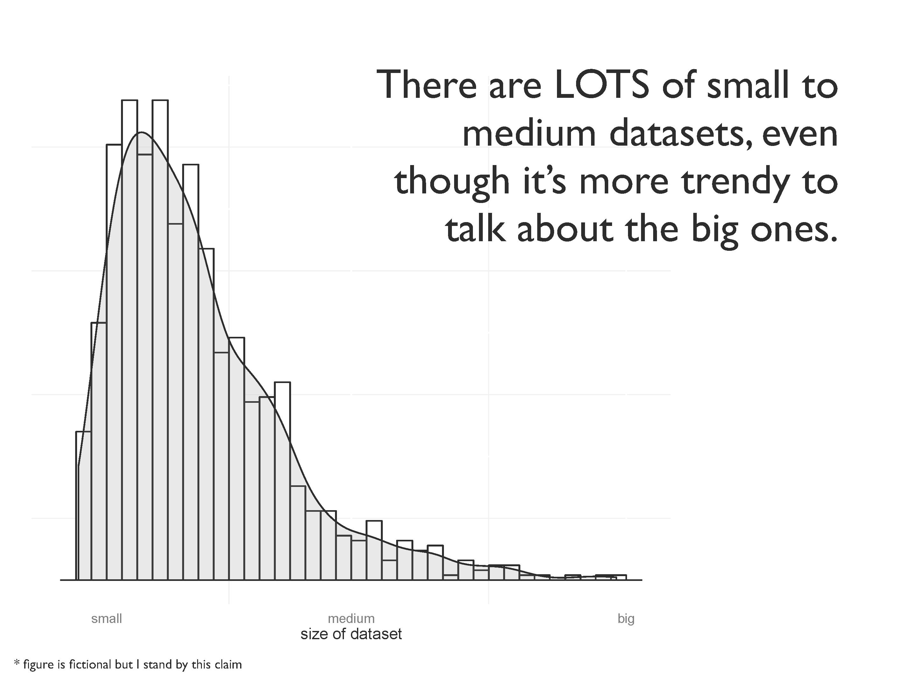

======================================================== 

======================================================== 
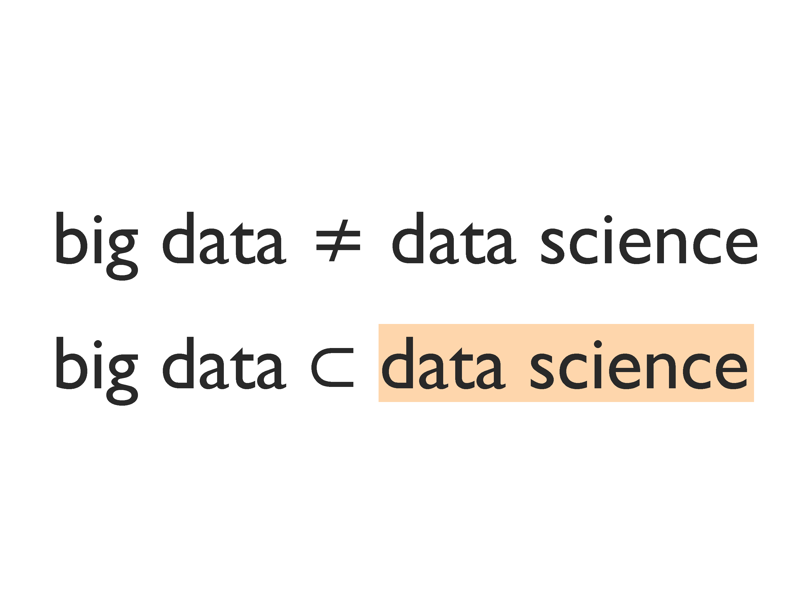

Two Inter-related Goals
======================================================== 
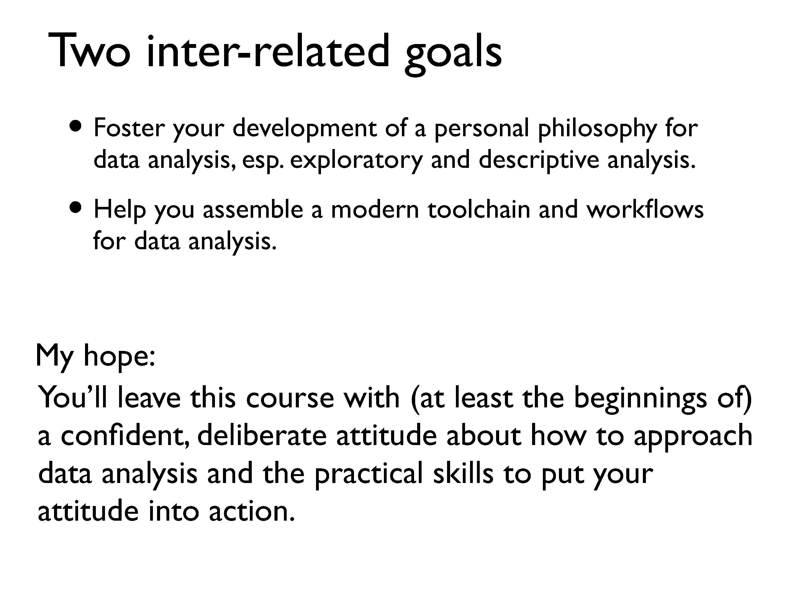

A Picture is worth 
======================================================== 
type: section
a thousand words

Challenger Disaster and Data Visualization
======================================================== 
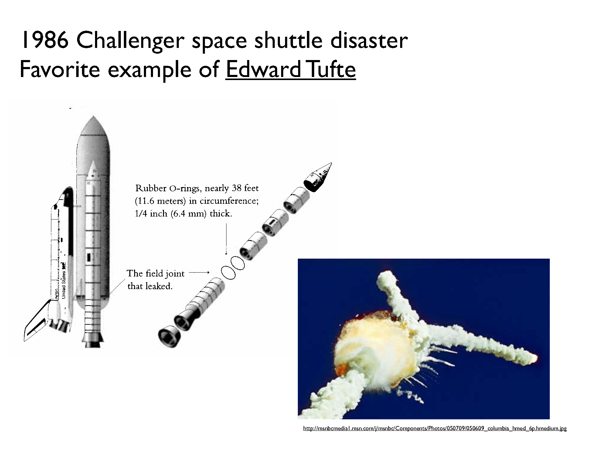

======================================================== 

======================================================== 

Edward Tufte, Expert in DataViz
======================================================== 

[His Website](http://www.edwardtufte.com)

[His Wikipedia Page](https://en.wikipedia.org/wiki/Edward_Tufte)

[Edward R. Tufte Books: ](https://www.amazon.com/Set-Edward-Tufte-Books-Quantitative/dp/B0083CS126/ref=sr_1_3?ie=UTF8&qid=1504544595&sr=8-3&keywords=Visual+Explanations%3A+Images+and+Quantities%2C+Evidence+and+Narrative)

  - Envisioning Information
  - The Visual Display of Quantitative Information
  - Visual Explanations: Images & Quantities, Evidence & Narrative
    - Chapter 5 is all about the Challenger Disaster
  - Beautiful Evidence 
  - Plus, Seeing Around Edward Tufte a Booklet/Gallery Guide 

[Edward Tufte](http://www.edwardtufte.com)

DataViz: Lets practice what we preach
======================================================== 
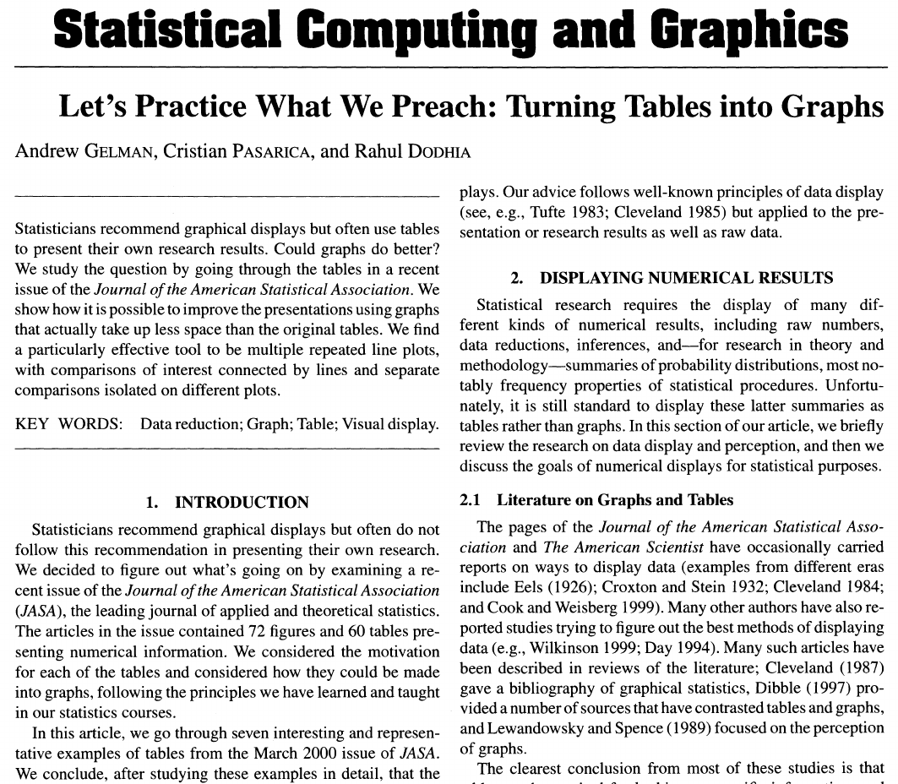

[Picture is worth](http://www.jstor.org/stable/3087382)

Lets Discuss the Aspects of Being a Data Scientist
==================================================
type:section

Recommended R Libraries
==================================================

We're running R 3.6.2 "Dark and Stormy Night"
  
  All our "Standard R Packages"" are loaded in the ODS VDI
   
  - ggplot2 - Mini-DSL for data visualization
    - Domain Specific Language = DSL
  - Tidyverse
  - zoo/xts - Time series libraries
  - plyr/reshape - Data reshaping/manipulation
  - data.table - Faster data.frame manipulation
  - e1071 - Machine learning/data mining functions
  - caret - Statistical learning/training functions
  - randomforest - Random forest library

Becoming a Data Scientist
====================================================

  - Data Science is a fast growing field in tech.
  - Data science includes people from multiple disciplines
    - [Becoming a Data Scientist Podcast](https://www.becomingadatascientist.com/category/podcast/) 
      - shows different ways people came to data science
  - Couples engineering, math, statistics, langue, computer science skills

How to Learn Data Science
=======================================================

Learn R first.

  - There are lots of different things you could learn like
    - Python
    - Hadoop
    - Pig
    - Hive
    - Tableau
  - But with limited time start with what will be most impactful

How to Learn Data Science
==========================================================

As you grow and develop you will learn new skills and tools

  - R is the most common programming language among data scientists. 
    - R is the most commonly used programming language (if you exclude SQL).
  - R has the tidyverse packages that streamline the data science workflow:
    - dplyr for data manipulation
    - ggplot2 for data visualization
  - R is common (and increasingly common) at the best tech companies 
    - like Google, Twitter, Netflix, LinkedIn, and Apple.
  
Learn Data Visualization First
============================================================

  - There are lots of things to learn
    - data visualization
    - machine learning
    - data wrangling
  - Looking at your data is the most powerful thing you can do
    - Plotting
    - Finding missing values
    - exploratory data analysis (initial)

Plots
===============================================================

  - the bar chart, the line chart, the scatterplot
  - the [small multiples design](https://en.wikipedia.org/wiki/Small_multiple)
  - the cross panels plot
  - These charts are the basis for more advanced visualizations. 
    - Bubble chart is just a variant of the scatterplot. 
    - Dot distribution map is nothing but a modified scatterplot.
  - These charts have a structure to them. 
    - When you learn that structure, 
    - You will start to learn about visualizing your data.
  - The charts are the essential “tools of insight.” 
    - Foundational tools for finding insights (during EDA)
    - Communicating insight. 
    - What do clients actually want and need.
    

Applying Visualizations
======================================================

  - Data Science is a tool to accomplish a task
    - Problem solving
    - Finding insights (Clients want insights)
  - Data Visualizations are how get visualization of data
    - Find Problems
    - Potential Solutions
  - Data Visualizations are necessary for good communication
    - No matter how wonderful your coding is, 
      - it doesn't matter unless you can communicate
    - Rmarkdown is great from begining thru the final report
  - You can't build useful models without data visualizations
    - Focus on visualizations in the first few reports

Learn Data Manipulation Second
=========================================================

  - Shape of Data
      - have multiple data files to join together
      - subset
      - change variables
      - aggregations
  - Learn
    - 5 basic dplyr verbs
    - “chaining”
    - the %>% operator
  - discussed more [in this blogpost](http://sharpsightlabs.com/blog/dplyr-intro-data-manipulation-with-r/)
  
Learn Machine Learning Last
===========================================================

  - Must Data Science Jobs are not related to machine learning
  - Having a good foundation in understanding data 
    - and getting your client what they want is important

Community Of Learning
===========================================================

   - Data science is still a growing field
   - No one is an expert in all things
   - Joining communities is paramount to learning
    - Meetups
    - Blogs
    - Podcasts
    - Community groups
    
  This class we want to have a community of learning!

Reproducible Research
=========================================================
type: section

Donald Knuth, A computer scientist and Case Alumnus
========================================================

[Donald Knuth](https://en.wikipedia.org/wiki/Donald_Knuth)

  - Alma mater	
    - Case Institute of Technology (B.S., M.S.) 1960
    - California Institute of Technology (Ph.D.)
  - ["Why I choose to go to Case Institute of Technology](https://www.webofstories.com/people/donald.knuth/10?o=SH)

The Art of Computer Programming, by Donald Knuth
==========================================================
Major things he's done in Computing

[The Art of Computer Programming](https://en.wikipedia.org/wiki/The_Art_of_Computer_Programming) 

  - (sometimes known by its initials TAOCP)
  - covers many kinds of programming algorithms and their analysis.
    
Literate Programming, by Donald Knuth
==========================================================

[Literature Programming](https://en.wikipedia.org/wiki/Literate_programming)

  - Literate programming is a programming paradigm introduced by Donald Knuth 
    - in which a program is given as an explanation of the program logic 
    - in a natural language, such as English, 
    - interspersed with snippets of macros and traditional source code, 
    - from which a compilable source code can be generated.

LaTeX, by Donald Knuth
==========================================================

[LaTeX publishing system](https://en.wikipedia.org/wiki/TeX)

  - A typesetting system designed & written by Donald Knuth, released in 1978. 
  - TeX was designed with two main goals in mind: 
    - to allow anybody to produce high-quality books using minimal effort, and 
    - to provide a system that would give exactly the same results on all computers, 
    - at any point in time.[2] 
  - TeX is free software, which made it accessible to a wide range of users

Weak Link: Reproducible Presentation and Reporting
======================================================== 
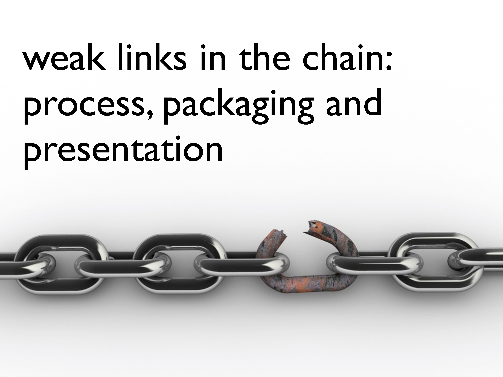

Data Snafu
======================================================== 

[Data Snafu](https://www.youtube.com/watch?v=N2zK3sAtr-4&feature=youtu.be)

======================================================== 

======================================================== 
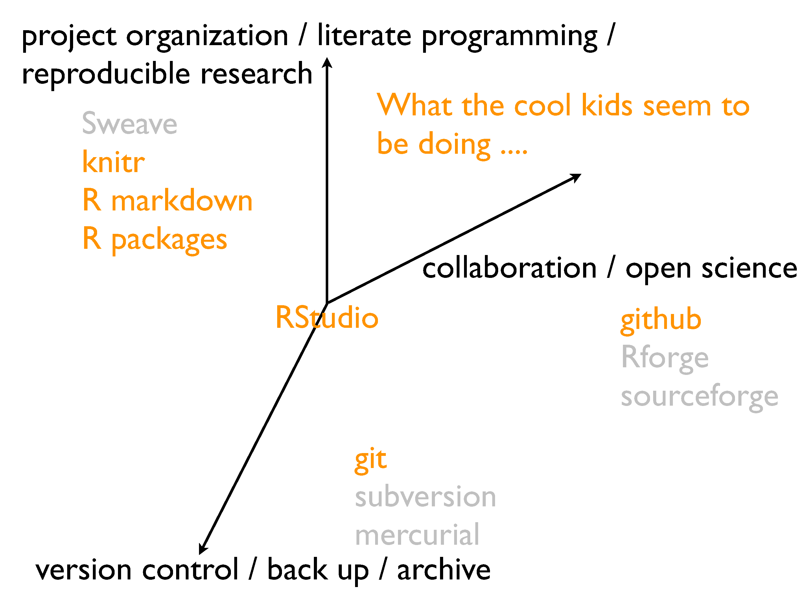

R with the RStudio Integrated Development Environment (IDE)
======================================================== 

RMarkdown for Reproducible Research and Collaboration 
======================================================== 

======================================================== 
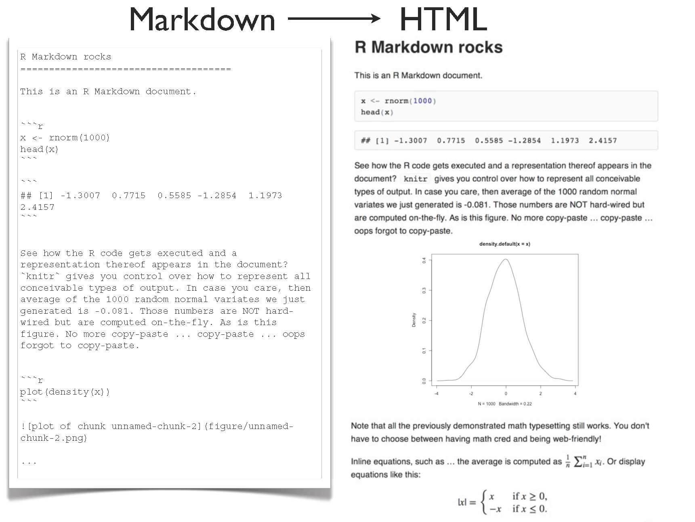

======================================================== 

The travails of BlahBlah-Final.docx
======================================================== 
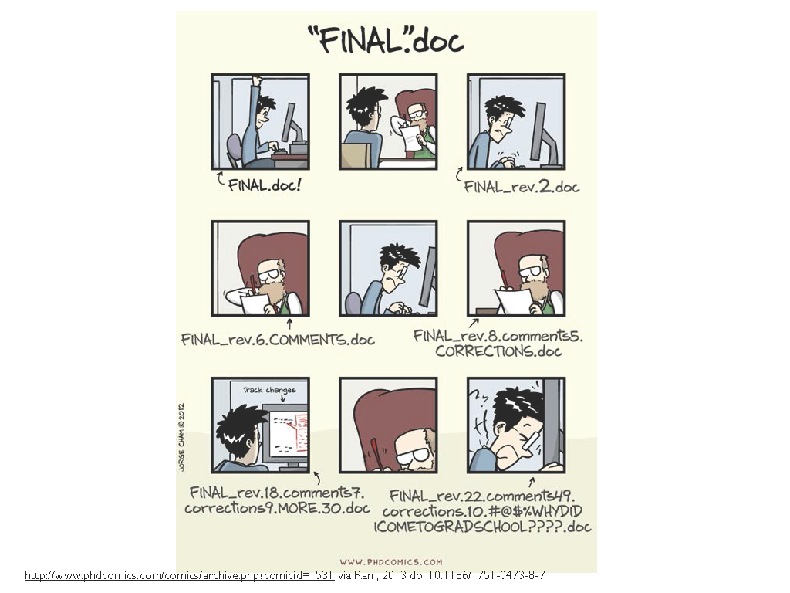

[Final.docx](http://www.phdcomics.com/comics/archive.php?comicid=1531)

Git for Code Version Control and Collaboration
======================================================== 
type:section

======================================================
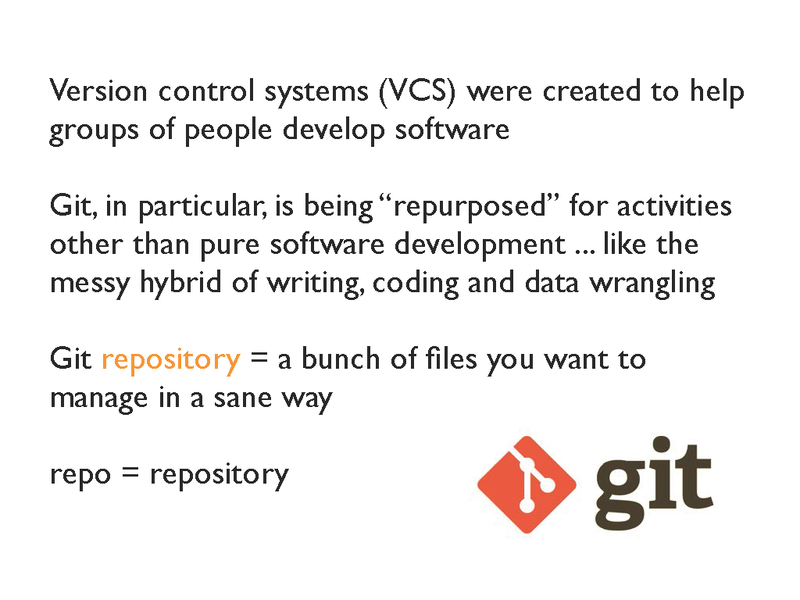

======================================================== 
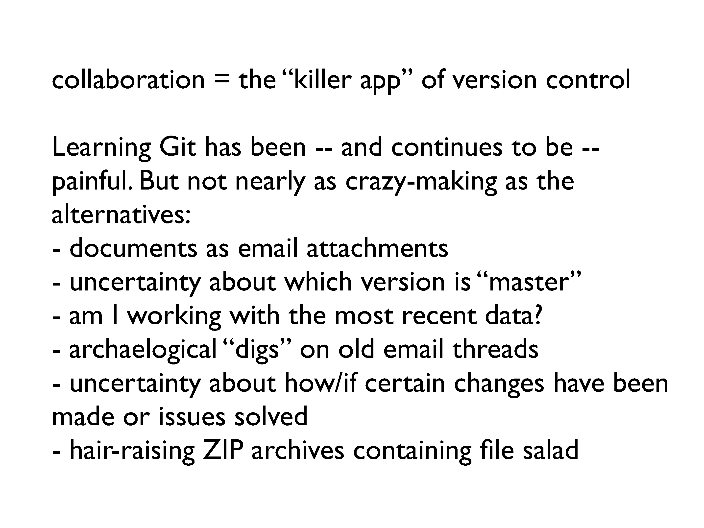

======================================================== 
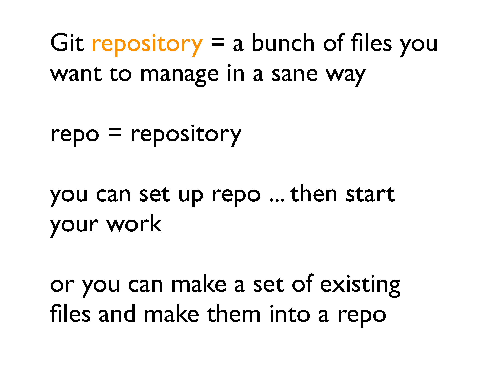

[We use BitBucket](http://www.bitbucket.org)
======================================================== 
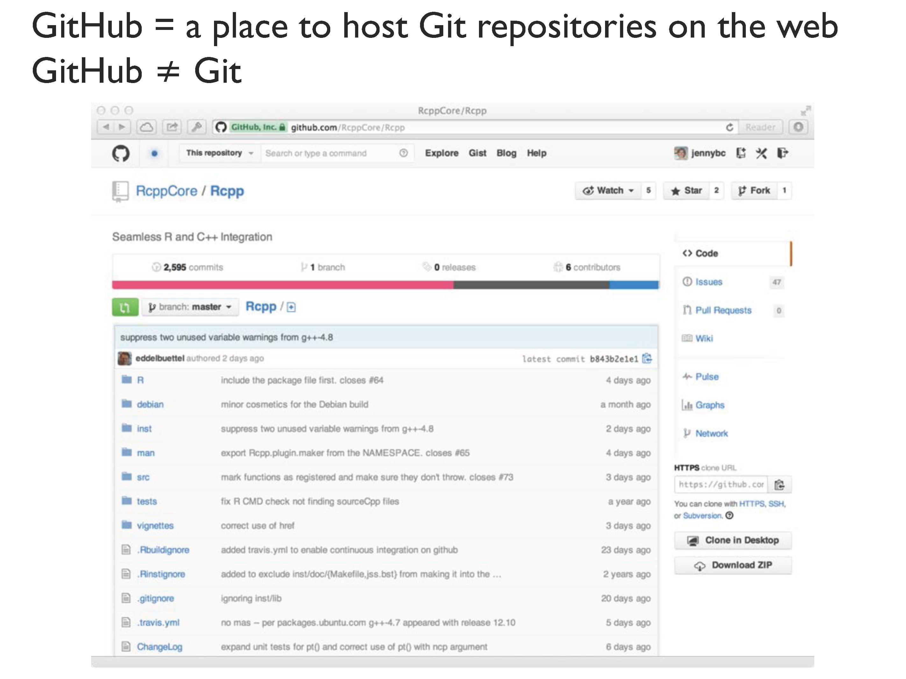

Different Schema for Repositories: There are many approaches
======================================================== 

======================================================== 

======================================================== 
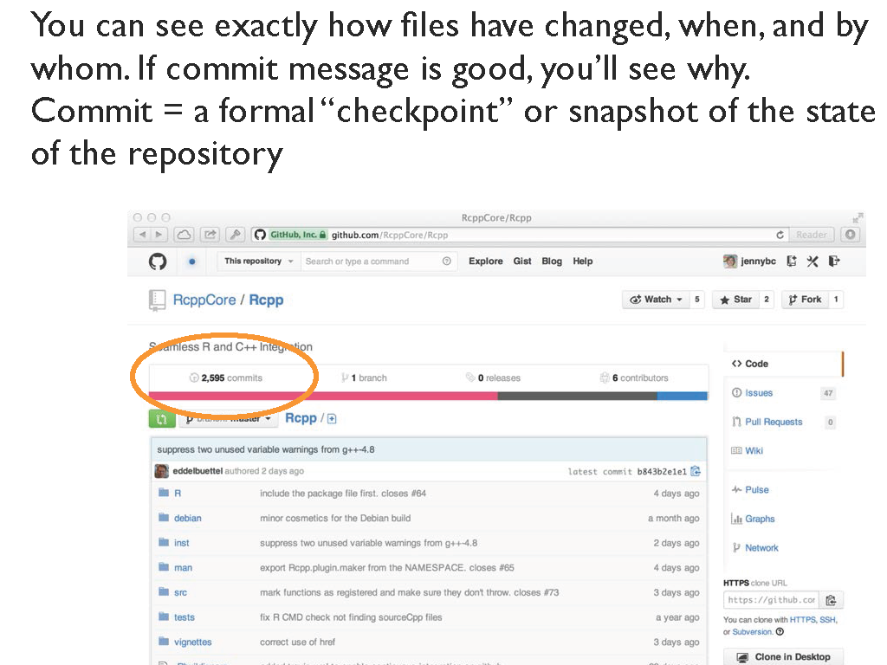

======================================================== 
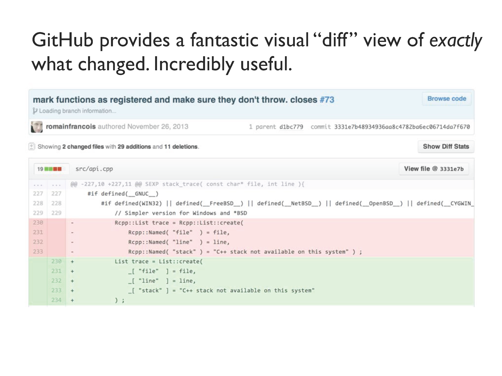

Data Visualization and Vis-Analytics are essential to  Data Science 
=========================================================
type:section

Dani Ushizima: LBNL, UC Berkeley 

  - [Toward Cancer Prevention: Pattern Recognition Applied to Cervical Cells](https://bids.berkeley.edu/resources/videos/toward-cancer-prevention-pattern-recognition-applied-cervical-cells)

======================================================== 

======================================================== 
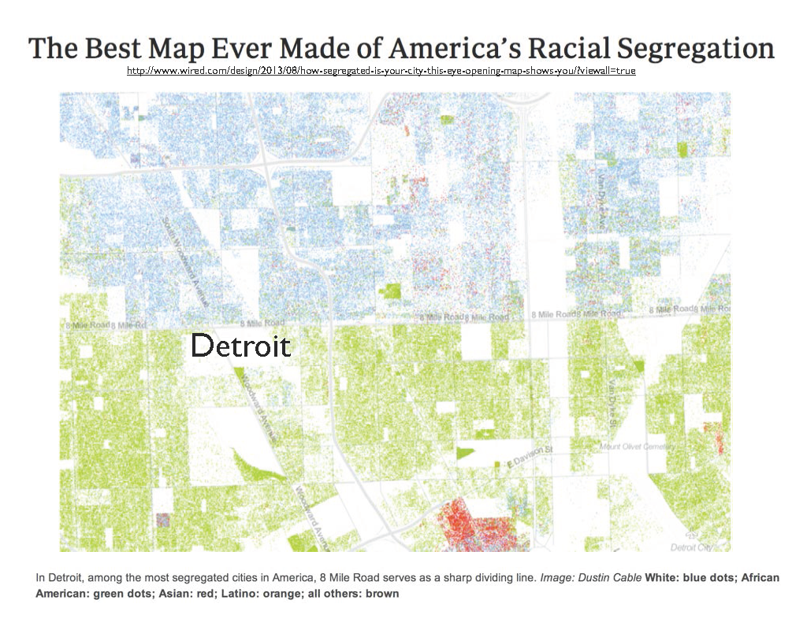

======================================================== 

======================================================== 
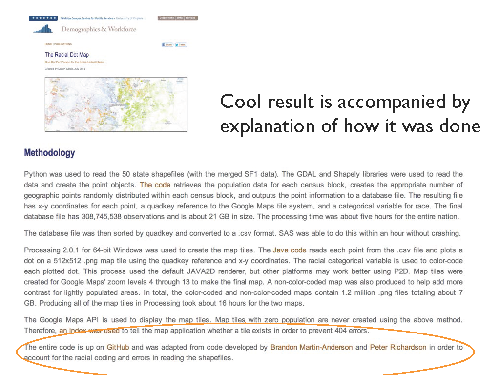

======================================================== 

Open Collaboration: Literate Programming and Reproducible Research
======================================================== 
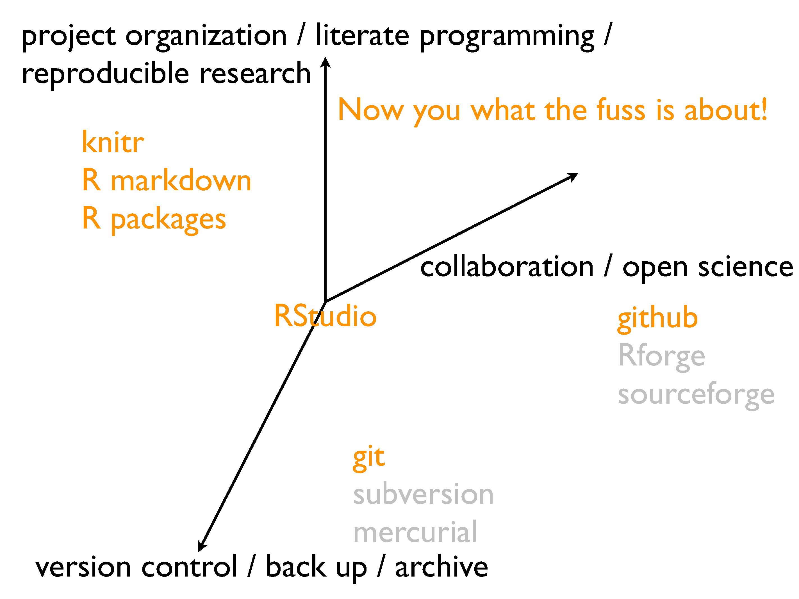

Source Code Is Real 
======================================================== 
type:section

=======================================================
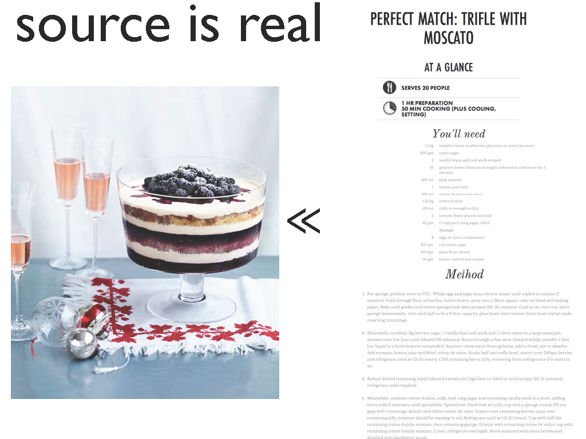

======================================================== 

======================================================== 

======================================================== 

Links
======================================================== 

[R Project for Statistical Computing](http://www.r-project.org) 

Jenny Bryan, Stats 545 UBC

  - http://stat545-ubc.github.io/cm001_course-intro-sw-install-account-signup.html
  - https://venturebeat.com/2017/02/18/the-one-critical-skill-many-data-scientists-are-missing/
  - https://blog.stitchdata.com/5-things-you-should-know-before-getting-a-degree-in-data-science-40cddf44aac3
  - http://sharpsightlabs.com/blog/how-to-start-learning-data-science/
  - http://sharpsightlabs.com/blog/start-with-data-visualization-manipulation/
 

